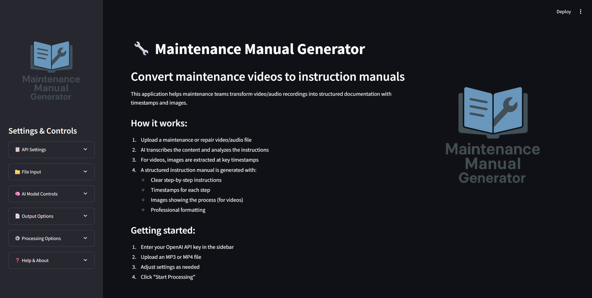

# GPT Maintenance Manual Generator

🔧 **An AI-powered tool that converts maintenance and repair videos into structured instruction manuals with timestamps and images.**


## Features

- **Audio/Video Processing**: Upload MP3 or MP4 files for processing
- **AI Transcription**: Uses OpenAI's Whisper API for accurate transcription
- **Multi-language Support**: Automatic language detection and translation to English
- **Smart Content Organization**: AI organizes content into logical sections
- **Timestamp Integration**: Preserves timestamps for easy reference
- **Image Extraction**: Automatically extracts key frames from videos
- **Professional Documents**: Generates formatted Word documents
- **Customizable Output**: Flexible formatting and content options

## Interface Preview



## Getting Started

### Prerequisites

- Python 3.8 or higher
- OpenAI API key
- Required Python packages (see requirements.txt)

### Installation

1. Clone the repository:
```bash
git clone https://github.com/Toochii2/gpt-maintenance-manual-generator.git
cd gpt-maintenance-manual-generator
```

2. Create a virtual environment:
```bash
python -m venv venv
source venv/bin/activate  # On Windows: venv\Scripts\activate
```

3. Install dependencies:
```bash
pip install -r requirements.txt
```

4. Run the application:
```bash
streamlit run app.py
```

### Usage

1. **Enter OpenAI API Key**: Input your OpenAI API key in the sidebar
2. **Upload File**: Choose an MP3 or MP4 file to process
3. **Configure Settings**: Adjust AI model settings, output options, and processing preferences
4. **Generate Manual**: Click "Process File" to generate your maintenance manual
5. **Download**: Download the generated Word document with instructions and images

## Configuration Options

### AI Model Settings
- **Model Selection**: Choose between GPT-4o-mini and GPT-4o
- **Temperature Control**: Adjust creativity vs. consistency (0.0-1.0)
- **Fact-checking Levels**: 
  - Strict (only transcript facts)
  - Balanced (minimal inference)
  - Flexible (allow helpful additions)

### Output Customization
- Custom manual titles
- Timestamp positioning options
- Image size adjustment for videos
- Original language transcript inclusion

## System Requirements

- **RAM**: Minimum 4GB, recommended 8GB+
- **Storage**: 2GB free space for processing temporary files
- **Internet**: Required for OpenAI API calls
- **OS**: Windows, macOS, or Linux

## Dependencies

- **Streamlit**: Web application framework
- **OpenAI**: API for transcription and content generation
- **python-docx**: Word document generation
- **pydub**: Audio processing
- **moviepy**: Video processing
- **OpenCV**: Image extraction and processing
- **Pillow**: Image manipulation
- **NumPy**: Numerical operations

## Contributing

1. Fork the repository
2. Create a feature branch (`git checkout -b feature/amazing-feature`)
3. Commit your changes (`git commit -m 'Add amazing feature'`)
4. Push to the branch (`git push origin feature/amazing-feature`)
5. Open a Pull Request

## License

This project is licensed under the MIT License - see the [LICENSE](LICENSE) file for details.

## Support

If you encounter any issues or have questions:
- Open an issue on GitHub
- Check the built-in help section in the application
- Review the troubleshooting guide in the documentation

## Acknowledgments

- OpenAI for the Whisper transcription API
- Streamlit community for the excellent web framework
- Contributors and testers who helped improve the application

---

**Made with ❤️ for maintenance professionals and DIY enthusiasts**
